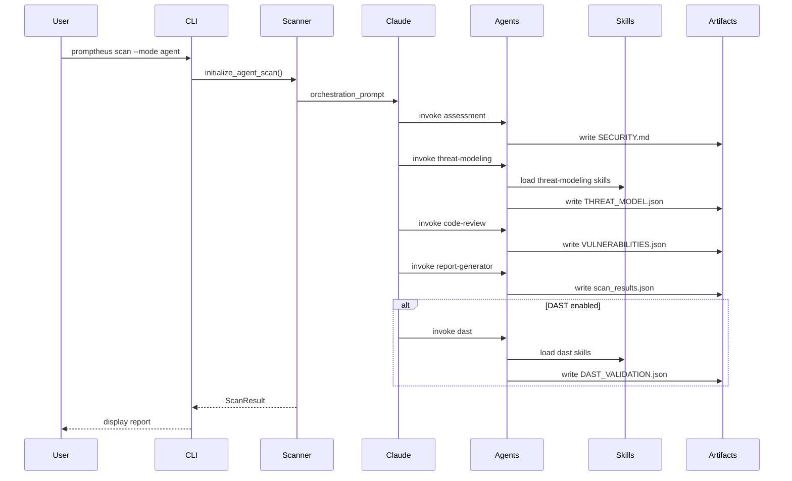

# Design Document: PROMPTHEUS Agent-Based Security Scanning

## Overview

This design enhances PROMPTHEUS with agent-based security scanning capabilities, transforming it from a simple payload-based red-team tool into a comprehensive multi-phase security analysis platform. The enhancement maintains PROMPTHEUS's hexagonal architecture while adding agent orchestration, DAST validation, streaming progress, and skill-based testing capabilities.

The design preserves backward compatibility with existing adapters (local, REST, Slack) while introducing new agent-based scanning modes that leverage the existing skills structure in `promptheus/skills/`.

## Main Algorithm/Workflow



## Architecture Evolution

### Current PROMPTHEUS Architecture

```
promptheus/
├── core/
│   ├── attacks/            # Payload library
│   ├── judge/              # LLM-as-a-Judge
│   └── engine.py           # RedTeamEngine
├── adapters/               # Target adapters
├── interfaces/             # CLI/Dashboard/Slack
└── skills/                 # DAST & threat-modeling skills
```


### Proposed Architecture (Post-Integration)

```
promptheus/
├── core/
│   ├── attacks/            # Payload library (legacy mode)
│   ├── judge/              # LLM-as-a-Judge (legacy mode)
│   ├── engine.py           # RedTeamEngine (legacy mode)
│   ├── agents/             # NEW: Agent-based scanning
│   │   ├── definitions.py  # Agent configurations
│   │   ├── orchestrator.py # Claude orchestration
│   │   └── hooks.py        # Progress tracking hooks
│   └── scanner/            # NEW: Unified scanner interface
│       ├── scanner.py      # Main scanner with mode selection
│       ├── progress.py     # Progress tracking
│       └── artifacts.py    # Artifact management
├── adapters/               # Target adapters (unchanged)
├── interfaces/             # CLI/Dashboard/Slack (enhanced)
├── skills/                 # DAST & threat-modeling skills (unchanged)
└── utils/
    ├── loop_breaker.py     # Bot loop prevention
    └── streaming.py        # NEW: Streaming utilities
```

### Architecture Diagram

```mermaid
graph TB
    subgraph "User Interfaces"
        CLI[CLI Interface]
        Dashboard[Streamlit Dashboard]
        SlackBot[Slack Bot]
    end
    
    subgraph "Scanner Layer (NEW)"
        Scanner[Unified Scanner]
        ModeSelector[Mode Selector]
        ProgressTracker[Progress Tracker]
    end
    
    subgraph "Legacy Mode"
        Engine[RedTeamEngine]
        Payloads[Payload Library]
        Judge[LLM Judge]
    end
    
    subgraph "Agent Mode (NEW)"
        Orchestrator[Agent Orchestrator]
        AgentDefs[Agent Definitions]
        Hooks[Progress Hooks]
    end
    
    subgraph "Agents (NEW)"
        Assessment[Assessment Agent]
        ThreatModel[Threat Modeling Agent]
        CodeReview[Code Review Agent]
        ReportGen[Report Generator Agent]
        DAST[DAST Agent]
    end
    
    subgraph "Skills (Existing)"
        ThreatSkills[Threat Modeling Skills]
        DASTSkills[DAST Skills]
    end
    
    subgraph "Adapters (Existing)"
        LocalAdapter[Local Adapter]
        RESTAdapter[REST Adapter]
        SlackAdapter[Slack Adapter]
    end
    
    subgraph "Artifacts (NEW)"
        SecurityMD[SECURITY.md]
        ThreatJSON[THREAT_MODEL.json]
        VulnJSON[VULNERABILITIES.json]
        DASTJSON[DAST_VALIDATION.json]
        ResultsJSON[scan_results.json]
    end
    
    CLI --> Scanner
    Dashboard --> Scanner
    SlackBot --> Scanner
    
    Scanner --> ModeSelector
    ModeSelector --> Engine
    ModeSelector --> Orchestrator
    
    Engine --> Payloads
    Engine --> Judge
    Engine --> LocalAdapter
    Engine --> RESTAdapter
    Engine --> SlackAdapter
    
    Orchestrator --> AgentDefs
    Orchestrator --> Hooks
    Orchestrator --> ProgressTracker
    
    Orchestrator --> Assessment
    Orchestrator --> ThreatModel
    Orchestrator --> CodeReview
    Orchestrator --> ReportGen
    Orchestrator --> DAST
    
    Assessment --> SecurityMD
    ThreatModel --> ThreatSkills
    ThreatModel --> ThreatJSON
    CodeReview --> VulnJSON
    DAST --> DASTSkills
    DAST --> DASTJSON
    ReportGen --> ResultsJSON
    
    DAST --> RESTAdapter
```




## Components and Interfaces

### Component 1: Unified Scanner

**Purpose**: Provide a single entry point for both legacy payload-based scanning and new agent-based scanning

**Interface**:
```python
from enum import Enum
from dataclasses import dataclass
from typing import Optional, List

class ScanMode(Enum):
    LEGACY = "legacy"      # Original payload-based scanning
    AGENT = "agent"        # Multi-phase agent-based scanning
    HYBRID = "hybrid"      # Both modes combined

@dataclass
class ScanConfig:
    mode: ScanMode
    target_url: Optional[str] = None
    target_path: Optional[str] = None
    enable_dast: bool = False
    dast_target_url: Optional[str] = None
    dast_timeout: int = 120
    enable_streaming: bool = True
    max_turns: int = 50
    severity_threshold: str = "LOW"

class UnifiedScanner:
    """Main scanner interface supporting both legacy and agent modes."""
    
    def __init__(self, config: ScanConfig):
        """Initialize scanner with configuration."""
        pass
    
    def scan(self) -> ScanResult:
        """Execute scan based on configured mode."""
        pass
    
    def get_progress(self) -> ProgressState:
        """Get current scan progress (for streaming)."""
        pass
```

**Responsibilities**:
- Mode selection (legacy vs agent vs hybrid)
- Configuration validation
- Progress tracking coordination
- Result aggregation

### Component 2: Agent Orchestrator

**Purpose**: Manage Claude-based agent orchestration for multi-phase security scanning

**Interface**:
```python
from typing import Dict, List, Callable

class AgentOrchestrator:
    """Orchestrates multi-phase agent-based security scanning."""
    
    def __init__(
        self,
        repo_path: str,
        agent_definitions: Dict[str, AgentDefinition],
        hooks: Optional[Dict[str, Callable]] = None,
        max_turns: int = 50
    ):
        """Initialize orchestrator with agent definitions and hooks."""
        pass
    
    def run_full_scan(self, enable_dast: bool = False) -> AgentScanResult:
        """Run complete multi-phase scan (assessment → threat → review → report → dast)."""
        pass
    
    def run_single_agent(self, agent_name: str) -> AgentResult:
        """Run a single agent phase (for iterative testing)."""
        pass
    
    def get_artifacts(self) -> Dict[str, str]:
        """Retrieve all generated artifacts."""
        pass
```

**Responsibilities**:
- Agent lifecycle management
- Claude SDK integration
- Hook execution for progress tracking
- Artifact coordination


### Component 3: Agent Definitions

**Purpose**: Define specialized security agents with their prompts, tools, and models

**Interface**:
```python
from dataclasses import dataclass
from typing import List

@dataclass
class AgentDefinition:
    """Configuration for a specialized security agent."""
    
    name: str
    description: str
    prompt: str
    tools: List[str]
    model: str
    max_turns: Optional[int] = None

class AgentRegistry:
    """Registry of all available security agents."""
    
    ASSESSMENT = AgentDefinition(
        name="assessment",
        description="Document codebase architecture for security analysis",
        prompt="...",  # Full prompt in implementation
        tools=["Read", "Grep", "Glob", "LS", "Write"],
        model="claude-3-5-sonnet-20241022"
    )
    
    THREAT_MODELING = AgentDefinition(
        name="threat-modeling",
        description="Identify threats using STRIDE methodology",
        prompt="...",
        tools=["Read", "Grep", "Glob", "Write", "Skill"],
        model="claude-3-5-sonnet-20241022"
    )
    
    CODE_REVIEW = AgentDefinition(
        name="code-review",
        description="Find vulnerabilities with security thinking",
        prompt="...",
        tools=["Read", "Grep", "Glob", "Write"],
        model="claude-3-5-sonnet-20241022"
    )
    
    REPORT_GENERATOR = AgentDefinition(
        name="report-generator",
        description="Generate final scan report",
        prompt="...",
        tools=["Read", "Write"],
        model="claude-3-5-sonnet-20241022"
    )
    
    DAST = AgentDefinition(
        name="dast",
        description="Validate vulnerabilities via HTTP testing",
        prompt="...",
        tools=["Read", "Write", "Bash", "Skill"],
        model="claude-3-5-sonnet-20241022"
    )
    
    @classmethod
    def get_all(cls) -> Dict[str, AgentDefinition]:
        """Get all agent definitions."""
        pass
    
    @classmethod
    def get_agent(cls, name: str) -> AgentDefinition:
        """Get specific agent definition."""
        pass
```

**Responsibilities**:
- Agent configuration management
- Prompt templates
- Tool surface definitions
- Model selection per agent


### Component 4: Progress Tracker

**Purpose**: Provide real-time progress updates during agent-based scans

**Interface**:
```python
from dataclasses import dataclass
from typing import Optional, Set
from datetime import datetime

@dataclass
class PhaseProgress:
    """Progress information for a single phase."""
    
    phase_name: str
    phase_number: int
    total_phases: int
    status: str  # "running", "completed", "failed"
    start_time: datetime
    end_time: Optional[datetime] = None
    tools_used: int = 0
    files_read: Set[str] = field(default_factory=set)
    files_written: Set[str] = field(default_factory=set)
    artifacts_created: List[str] = field(default_factory=list)

class ProgressTracker:
    """Track and display real-time scan progress."""
    
    def __init__(self, debug_mode: bool = False):
        """Initialize progress tracker."""
        pass
    
    def on_phase_start(self, phase_name: str, phase_number: int, total_phases: int):
        """Called when a phase starts."""
        pass
    
    def on_tool_use(self, tool_name: str, tool_input: dict):
        """Called before tool execution."""
        pass
    
    def on_tool_complete(self, tool_name: str, success: bool):
        """Called after tool execution."""
        pass
    
    def on_phase_complete(self, phase_name: str, duration_ms: int):
        """Called when a phase completes."""
        pass
    
    def get_current_progress(self) -> PhaseProgress:
        """Get current phase progress."""
        pass
    
    def display_summary(self):
        """Display final scan summary."""
        pass
```

**Responsibilities**:
- Real-time progress tracking
- Tool usage monitoring
- File operation tracking
- Phase timing and statistics
- Console output formatting

### Component 5: Artifact Manager

**Purpose**: Manage security artifacts generated during scans

**Interface**:
```python
from pathlib import Path
from typing import Dict, Optional

class ArtifactManager:
    """Manage security scan artifacts."""
    
    def __init__(self, artifacts_dir: Path = Path(".promptheus")):
        """Initialize artifact manager."""
        pass
    
    def write_artifact(self, name: str, content: str):
        """Write an artifact to disk."""
        pass
    
    def read_artifact(self, name: str) -> Optional[str]:
        """Read an artifact from disk."""
        pass
    
    def artifact_exists(self, name: str) -> bool:
        """Check if artifact exists."""
        pass
    
    def get_all_artifacts(self) -> Dict[str, str]:
        """Get all artifacts as a dictionary."""
        pass
    
    def cleanup_artifacts(self, keep_latest: bool = True):
        """Clean up old artifacts."""
        pass
```

**Responsibilities**:
- Artifact file I/O
- Directory management
- Artifact validation
- Cleanup operations


### Component 6: Skill Loader

**Purpose**: Load and manage security testing skills for agents

**Interface**:
```python
from pathlib import Path
from typing import List, Dict

@dataclass
class Skill:
    """Represents a security testing skill."""
    
    name: str
    category: str  # "dast" or "threat-modeling"
    skill_path: Path
    cwe_coverage: List[str]
    description: str

class SkillLoader:
    """Load and manage security testing skills."""
    
    def __init__(self, skills_dir: Path = Path("promptheus/skills")):
        """Initialize skill loader."""
        pass
    
    def discover_skills(self, category: str) -> List[Skill]:
        """Discover all skills in a category."""
        pass
    
    def load_skill(self, skill_name: str) -> Skill:
        """Load a specific skill."""
        pass
    
    def get_skills_for_cwe(self, cwe_id: str) -> List[Skill]:
        """Get skills that can test a specific CWE."""
        pass
    
    def copy_skills_to_project(self, project_path: Path, category: str):
        """Copy skills to project .claude/skills/ directory."""
        pass
```

**Responsibilities**:
- Skill discovery and loading
- CWE mapping
- Skill deployment to projects
- Skill metadata management

## Data Models

### Model 1: ScanResult

```python
from dataclasses import dataclass, field
from typing import List, Optional
from datetime import datetime

@dataclass
class Issue:
    """Represents a security issue found during scanning."""
    
    id: str
    title: str
    description: str
    severity: str  # "CRITICAL", "HIGH", "MEDIUM", "LOW", "INFO"
    cwe_id: Optional[str] = None
    file_path: Optional[str] = None
    line_number: Optional[int] = None
    code_snippet: Optional[str] = None
    recommendation: Optional[str] = None
    evidence: Optional[str] = None
    validation_status: Optional[str] = None  # For DAST: "VALIDATED", "FALSE_POSITIVE", etc.

@dataclass
class ScanResult:
    """Aggregated scan results."""
    
    scan_id: str
    scan_mode: str  # "legacy", "agent", "hybrid"
    target: str
    timestamp: datetime
    duration_seconds: float
    issues: List[Issue] = field(default_factory=list)
    artifacts: Dict[str, str] = field(default_factory=dict)
    metadata: Dict[str, any] = field(default_factory=dict)
    
    def get_issues_by_severity(self, severity: str) -> List[Issue]:
        """Filter issues by severity."""
        pass
    
    def get_critical_count(self) -> int:
        """Count critical issues."""
        pass
    
    def get_validated_issues(self) -> List[Issue]:
        """Get DAST-validated issues."""
        pass
```

**Validation Rules**:
- `severity` must be one of: CRITICAL, HIGH, MEDIUM, LOW, INFO
- `scan_mode` must be one of: legacy, agent, hybrid
- `validation_status` (if present) must be one of: VALIDATED, FALSE_POSITIVE, PARTIAL, UNVALIDATED


### Model 2: AgentScanResult

```python
@dataclass
class AgentPhaseResult:
    """Result from a single agent phase."""
    
    agent_name: str
    phase_number: int
    status: str  # "success", "failed", "skipped"
    duration_seconds: float
    tools_used: int
    files_read: int
    files_written: int
    artifacts_created: List[str]
    error_message: Optional[str] = None

@dataclass
class AgentScanResult:
    """Result from agent-based scanning."""
    
    scan_id: str
    repo_path: str
    timestamp: datetime
    phases: List[AgentPhaseResult] = field(default_factory=list)
    total_duration_seconds: float = 0.0
    issues: List[Issue] = field(default_factory=list)
    artifacts: Dict[str, str] = field(default_factory=dict)
    
    def get_phase_result(self, agent_name: str) -> Optional[AgentPhaseResult]:
        """Get result for specific phase."""
        pass
    
    def all_phases_successful(self) -> bool:
        """Check if all phases completed successfully."""
        pass
```

### Model 3: Threat

```python
@dataclass
class Threat:
    """Represents a threat identified during threat modeling."""
    
    id: str
    category: str  # STRIDE category
    title: str
    description: str
    severity: str
    affected_components: List[str]
    attack_scenario: str
    vulnerability_types: List[str]  # CWE IDs
    mitigation: str
    existing_controls: List[str]
    control_effectiveness: str  # "none", "partial", "substantial"
    attack_complexity: str  # "low", "medium", "high"
    likelihood: str  # "low", "medium", "high"
    impact: str  # "low", "medium", "high", "critical"
    risk_score: str  # "low", "medium", "high", "critical"
    residual_risk: str
```

### Model 4: DASTValidation

```python
@dataclass
class HTTPTestDetails:
    """Details of an HTTP test."""
    
    url: str
    method: str
    status: int
    response_snippet: str
    response_hash: str
    truncated: bool
    original_size_bytes: int

@dataclass
class DASTValidation:
    """DAST validation result for a vulnerability."""
    
    vulnerability_id: str
    cwe_id: str
    skill_used: str
    validation_status: str  # "VALIDATED", "FALSE_POSITIVE", "PARTIAL", "UNVALIDATED"
    test_details: Dict[str, HTTPTestDetails]
    evidence: str
    timestamp: datetime
```


## Algorithmic Pseudocode

### Main Scanning Algorithm

```pascal
ALGORITHM unified_scan(config: ScanConfig)
INPUT: config of type ScanConfig
OUTPUT: result of type ScanResult

PRECONDITIONS:
  - config is validated and well-formed
  - config.mode is one of: LEGACY, AGENT, HYBRID
  - If config.enable_dast is true, config.dast_target_url must be set

POSTCONDITIONS:
  - result contains all identified issues
  - result.artifacts contains all generated artifacts
  - All phases completed or error reported

BEGIN
  ASSERT config is valid
  
  // Initialize scanner based on mode
  IF config.mode = LEGACY THEN
    result ← run_legacy_scan(config)
  ELSE IF config.mode = AGENT THEN
    result ← run_agent_scan(config)
  ELSE IF config.mode = HYBRID THEN
    legacy_result ← run_legacy_scan(config)
    agent_result ← run_agent_scan(config)
    result ← merge_results(legacy_result, agent_result)
  END IF
  
  ASSERT result is complete AND result.issues is not null
  
  RETURN result
END

LOOP INVARIANTS:
  - All completed phases have valid results
  - Artifacts are written to disk before next phase
  - Progress tracker state is consistent
```

### Agent Orchestration Algorithm

```pascal
ALGORITHM run_agent_scan(config: ScanConfig)
INPUT: config of type ScanConfig
OUTPUT: result of type AgentScanResult

PRECONDITIONS:
  - config.target_path exists and is readable
  - Claude SDK is initialized
  - Agent definitions are loaded

POSTCONDITIONS:
  - All required phases completed (assessment, threat, review, report)
  - Optional DAST phase completed if config.enable_dast is true
  - All artifacts written to .promptheus/ directory

BEGIN
  ASSERT config.target_path exists
  
  // Initialize components
  orchestrator ← create_orchestrator(config)
  progress_tracker ← create_progress_tracker(config.enable_streaming)
  artifact_manager ← create_artifact_manager()
  
  // Define agent execution order
  required_phases ← ["assessment", "threat-modeling", "code-review", "report-generator"]
  optional_phases ← []
  
  IF config.enable_dast THEN
    optional_phases.append("dast")
  END IF
  
  all_phases ← required_phases + optional_phases
  phase_results ← []
  
  // Execute each phase sequentially
  FOR each phase IN all_phases DO
    ASSERT all_previous_phases_successful(phase_results)
    
    progress_tracker.on_phase_start(phase, index, total_phases)
    
    phase_result ← orchestrator.run_agent(phase)
    
    IF phase_result.status = "failed" THEN
      RETURN create_error_result(phase, phase_result.error_message)
    END IF
    
    phase_results.append(phase_result)
    progress_tracker.on_phase_complete(phase, phase_result.duration_ms)
  END FOR
  
  // Aggregate results
  issues ← extract_issues_from_artifacts(artifact_manager)
  artifacts ← artifact_manager.get_all_artifacts()
  
  result ← create_agent_scan_result(phase_results, issues, artifacts)
  
  ASSERT result.all_phases_successful()
  
  RETURN result
END

LOOP INVARIANTS:
  - All completed phases have written their artifacts
  - Phase results are accumulated in order
  - Progress tracker reflects current phase
```


### Progress Tracking Algorithm

```pascal
ALGORITHM track_progress_with_hooks(orchestrator: AgentOrchestrator)
INPUT: orchestrator configured with agent definitions
OUTPUT: real-time progress updates via console

PRECONDITIONS:
  - orchestrator is initialized
  - progress_tracker is initialized
  - hooks are registered with Claude SDK

POSTCONDITIONS:
  - All tool uses are logged
  - All phase transitions are tracked
  - Final summary is displayed

BEGIN
  // Register hooks as closures
  
  PROCEDURE pre_tool_hook(input_data, tool_use_id, ctx)
    tool_name ← input_data.get("tool_name")
    tool_input ← input_data.get("tool_input")
    
    progress_tracker.on_tool_start(tool_name, tool_input)
    
    // Display real-time progress
    IF tool_name = "Read" THEN
      DISPLAY "📖 Reading " + tool_input.path
    ELSE IF tool_name = "Write" THEN
      DISPLAY "💾 Writing " + tool_input.path
    ELSE IF tool_name = "Grep" THEN
      DISPLAY "🔍 Searching: " + tool_input.pattern
    ELSE IF tool_name = "Skill" THEN
      DISPLAY "🎯 Loading skill: " + tool_input.skill_name
    END IF
    
    RETURN {}
  END PROCEDURE
  
  PROCEDURE post_tool_hook(input_data, tool_use_id, ctx)
    tool_name ← input_data.get("tool_name")
    is_error ← input_data.get("tool_response").get("is_error")
    
    progress_tracker.on_tool_complete(tool_name, NOT is_error)
    
    IF is_error THEN
      DISPLAY "❌ Tool failed: " + tool_name
    END IF
    
    RETURN {}
  END PROCEDURE
  
  PROCEDURE subagent_stop_hook(input_data, tool_use_id, ctx)
    agent_name ← input_data.get("agent_name")
    duration_ms ← input_data.get("duration_ms")
    
    progress_tracker.on_subagent_stop(agent_name, duration_ms)
    
    // Display phase completion
    stats ← progress_tracker.get_phase_stats(agent_name)
    DISPLAY "✅ Phase " + agent_name + " Complete"
    DISPLAY "   Duration: " + format_duration(duration_ms)
    DISPLAY "   Tools: " + stats.tools_used
    DISPLAY "   Files: " + stats.files_read + " read, " + stats.files_written + " written"
    
    RETURN {}
  END PROCEDURE
  
  // Register hooks with orchestrator
  orchestrator.register_hook("PreToolUse", pre_tool_hook)
  orchestrator.register_hook("PostToolUse", post_tool_hook)
  orchestrator.register_hook("SubagentStop", subagent_stop_hook)
END

LOOP INVARIANTS:
  - Hook state is consistent with actual execution
  - Progress display matches actual phase
  - Tool counts are accurate
```

### DAST Validation Algorithm

```pascal
ALGORITHM validate_vulnerabilities_with_dast(vulnerabilities, target_url, skills)
INPUT: vulnerabilities (list of Issue), target_url (string), skills (list of Skill)
OUTPUT: validations (list of DASTValidation)

PRECONDITIONS:
  - target_url is reachable
  - vulnerabilities list is not empty
  - skills are loaded and available

POSTCONDITIONS:
  - Each vulnerability has a validation status
  - HTTP tests are executed for applicable vulnerabilities
  - Evidence is captured for all tests

BEGIN
  ASSERT target_url is reachable
  ASSERT vulnerabilities is not empty
  
  validations ← []
  
  FOR each vuln IN vulnerabilities DO
    ASSERT vuln.cwe_id is not null
    
    // Find matching skill for CWE
    matching_skill ← find_skill_for_cwe(skills, vuln.cwe_id)
    
    IF matching_skill is null THEN
      // No skill available, mark as unvalidated
      validation ← create_validation(
        vuln.id,
        vuln.cwe_id,
        "none",
        "UNVALIDATED",
        {},
        "No applicable validation skill"
      )
      validations.append(validation)
      CONTINUE
    END IF
    
    // Execute skill-based validation
    DISPLAY "🌐 Testing: " + vuln.title + " using " + matching_skill.name
    
    test_result ← execute_skill_test(matching_skill, vuln, target_url)
    
    // Determine validation status
    IF test_result.exploitable THEN
      status ← "VALIDATED"
      evidence ← "Vulnerability confirmed: " + test_result.evidence
    ELSE IF test_result.controls_working THEN
      status ← "FALSE_POSITIVE"
      evidence ← "Security controls working: " + test_result.evidence
    ELSE IF test_result.partial THEN
      status ← "PARTIAL"
      evidence ← "Mixed results: " + test_result.evidence
    ELSE
      status ← "UNVALIDATED"
      evidence ← "Test inconclusive: " + test_result.evidence
    END IF
    
    validation ← create_validation(
      vuln.id,
      vuln.cwe_id,
      matching_skill.name,
      status,
      test_result.http_details,
      evidence
    )
    
    validations.append(validation)
  END FOR
  
  ASSERT validations.length = vulnerabilities.length
  
  RETURN validations
END

LOOP INVARIANTS:
  - Each processed vulnerability has a validation entry
  - HTTP test details are captured
  - Validation status is one of: VALIDATED, FALSE_POSITIVE, PARTIAL, UNVALIDATED
```


## Key Functions with Formal Specifications

### Function 1: initialize_agent_orchestrator()

```python
def initialize_agent_orchestrator(
    repo_path: str,
    config: ScanConfig,
    progress_tracker: ProgressTracker
) -> AgentOrchestrator
```

**Preconditions:**
- `repo_path` exists and is a valid directory
- `config` is validated
- `progress_tracker` is initialized
- Claude SDK is available and API key is set

**Postconditions:**
- Returns initialized AgentOrchestrator instance
- All agent definitions are loaded
- Hooks are registered with progress_tracker
- Orchestrator is ready to execute scans

**Loop Invariants:** N/A (no loops in function)

### Function 2: run_agent_phase()

```python
def run_agent_phase(
    agent_name: str,
    orchestrator: AgentOrchestrator,
    artifact_manager: ArtifactManager
) -> AgentPhaseResult
```

**Preconditions:**
- `agent_name` is a valid agent in AgentRegistry
- `orchestrator` is initialized
- `artifact_manager` is initialized
- Previous phase artifacts exist (if not first phase)

**Postconditions:**
- Returns AgentPhaseResult with status "success" or "failed"
- If successful: phase artifact is written to disk
- If failed: error_message is populated
- Tool usage and file operations are tracked

**Loop Invariants:** N/A (orchestrator handles internal loops)

### Function 3: merge_scan_results()

```python
def merge_scan_results(
    legacy_result: ScanResult,
    agent_result: AgentScanResult
) -> ScanResult
```

**Preconditions:**
- `legacy_result` is a valid ScanResult from payload-based scan
- `agent_result` is a valid AgentScanResult from agent-based scan
- Both results are from the same target

**Postconditions:**
- Returns merged ScanResult containing issues from both scans
- Duplicate issues are deduplicated by CWE and location
- Artifacts from both scans are preserved
- Metadata indicates hybrid scan mode

**Loop Invariants:**
- For issue deduplication loop: All previously processed issues are unique
- For artifact merging loop: All artifact names remain unique

### Function 4: load_and_deploy_skills()

```python
def load_and_deploy_skills(
    category: str,
    project_path: Path,
    skill_loader: SkillLoader
) -> List[Skill]
```

**Preconditions:**
- `category` is one of: "dast", "threat-modeling"
- `project_path` exists and is writable
- `skill_loader` is initialized

**Postconditions:**
- Returns list of loaded skills
- Skills are copied to `{project_path}/.claude/skills/{category}/`
- Skill metadata is validated
- All skills have valid SKILL.md files

**Loop Invariants:**
- For skill discovery loop: All discovered skills have valid structure
- For deployment loop: All deployed skills maintain directory structure


### Function 5: validate_scan_config()

```python
def validate_scan_config(config: ScanConfig) -> Tuple[bool, Optional[str]]
```

**Preconditions:**
- `config` is a ScanConfig instance (may be invalid)

**Postconditions:**
- Returns (True, None) if config is valid
- Returns (False, error_message) if config is invalid
- Validation checks:
  - If mode is AGENT or HYBRID: target_path must be set
  - If enable_dast is True: dast_target_url must be set
  - severity_threshold must be valid
  - max_turns must be positive

**Loop Invariants:** N/A (no loops in function)

### Function 6: extract_issues_from_artifacts()

```python
def extract_issues_from_artifacts(
    artifact_manager: ArtifactManager
) -> List[Issue]
```

**Preconditions:**
- `artifact_manager` is initialized
- VULNERABILITIES.json artifact exists
- VULNERABILITIES.json contains valid JSON array

**Postconditions:**
- Returns list of Issue objects parsed from artifacts
- If DAST_VALIDATION.json exists: validation statuses are merged
- All issues have required fields populated
- Issues are sorted by severity (CRITICAL → INFO)

**Loop Invariants:**
- For vulnerability parsing loop: All parsed issues have valid severity
- For DAST merging loop: Each validation matches exactly one issue

## Example Usage

### Example 1: Legacy Mode Scan

```python
from promptheus.core.scanner import UnifiedScanner, ScanConfig, ScanMode

# Configure legacy payload-based scan
config = ScanConfig(
    mode=ScanMode.LEGACY,
    target_url="https://api.example.com/chat"
)

# Run scan
scanner = UnifiedScanner(config)
result = scanner.scan()

# Display results
print(f"Found {len(result.issues)} issues")
for issue in result.get_issues_by_severity("CRITICAL"):
    print(f"  - {issue.title}")
```

### Example 2: Agent Mode Scan with DAST

```python
from promptheus.core.scanner import UnifiedScanner, ScanConfig, ScanMode

# Configure agent-based scan with DAST validation
config = ScanConfig(
    mode=ScanMode.AGENT,
    target_path="./my-app",
    enable_dast=True,
    dast_target_url="http://localhost:3000",
    enable_streaming=True
)

# Run scan with real-time progress
scanner = UnifiedScanner(config)
result = scanner.scan()

# Check DAST-validated issues
validated = result.get_validated_issues()
print(f"Validated {len(validated)} vulnerabilities via DAST")
```

### Example 3: Hybrid Mode Scan

```python
from promptheus.core.scanner import UnifiedScanner, ScanConfig, ScanMode

# Configure hybrid scan (both legacy and agent modes)
config = ScanConfig(
    mode=ScanMode.HYBRID,
    target_url="https://api.example.com/chat",  # For legacy mode
    target_path="./my-app",                      # For agent mode
    enable_dast=True,
    dast_target_url="http://localhost:3000"
)

# Run comprehensive scan
scanner = UnifiedScanner(config)
result = scanner.scan()

# Results include both payload-based and agent-based findings
print(f"Scan mode: {result.scan_mode}")
print(f"Total issues: {len(result.issues)}")
print(f"Critical: {result.get_critical_count()}")
```


### Example 4: Iterative DAST Testing

```python
from promptheus.core.scanner import UnifiedScanner, ScanConfig, ScanMode

# Initial full scan
config = ScanConfig(
    mode=ScanMode.AGENT,
    target_path="./my-app",
    enable_dast=True,
    dast_target_url="http://localhost:3000"
)

scanner = UnifiedScanner(config)
result = scanner.scan()

# Review DAST results
print("Initial DAST validation:")
for issue in result.get_validated_issues():
    print(f"  ✅ {issue.title} - {issue.validation_status}")

# Fix vulnerabilities in code...

# Re-run DAST only (faster, reuses static analysis)
config.mode = ScanMode.AGENT
config.subagent_only = "dast"  # Run only DAST phase

scanner = UnifiedScanner(config)
result = scanner.scan()

# Verify fixes
print("\nAfter fixes:")
for issue in result.issues:
    if issue.validation_status == "FALSE_POSITIVE":
        print(f"  ✅ Fixed: {issue.title}")
    elif issue.validation_status == "VALIDATED":
        print(f"  ❌ Still vulnerable: {issue.title}")
```

### Example 5: CLI Integration

```python
# apps/cli/main.py

import click
from promptheus.core.scanner import UnifiedScanner, ScanConfig, ScanMode

@click.command()
@click.option("--mode", type=click.Choice(["legacy", "agent", "hybrid"]), default="legacy")
@click.option("--target-url", help="Target URL for legacy/hybrid mode")
@click.option("--target-path", help="Target path for agent/hybrid mode")
@click.option("--dast", is_flag=True, help="Enable DAST validation")
@click.option("--dast-url", help="Target URL for DAST testing")
@click.option("--streaming/--no-streaming", default=True, help="Enable real-time progress")
def scan(mode, target_url, target_path, dast, dast_url, streaming):
    """Run security scan with specified mode."""
    
    # Build config
    config = ScanConfig(
        mode=ScanMode[mode.upper()],
        target_url=target_url,
        target_path=target_path,
        enable_dast=dast,
        dast_target_url=dast_url,
        enable_streaming=streaming
    )
    
    # Validate config
    valid, error = validate_scan_config(config)
    if not valid:
        click.echo(f"Error: {error}", err=True)
        return 1
    
    # Run scan
    scanner = UnifiedScanner(config)
    result = scanner.scan()
    
    # Display results
    click.echo(f"\n{'='*60}")
    click.echo(f"Scan Complete: {result.scan_mode} mode")
    click.echo(f"{'='*60}")
    click.echo(f"Total issues: {len(result.issues)}")
    click.echo(f"  Critical: {result.get_critical_count()}")
    click.echo(f"  High: {len(result.get_issues_by_severity('HIGH'))}")
    click.echo(f"  Medium: {len(result.get_issues_by_severity('MEDIUM'))}")
    click.echo(f"  Low: {len(result.get_issues_by_severity('LOW'))}")
    
    if dast:
        validated = result.get_validated_issues()
        click.echo(f"\nDAST validated: {len(validated)} vulnerabilities")
    
    return 0 if result.get_critical_count() == 0 else 1
```


## Correctness Properties

*A property is a characteristic or behavior that should hold true across all valid executions of a system—essentially, a formal statement about what the system should do. Properties serve as the bridge between human-readable specifications and machine-verifiable correctness guarantees.*

### Property 1: Mode Consistency

*For any* scan execution, the scan mode must be one of the three supported modes, and mode-specific invariants must hold.

**Validates: Requirements 1.1, 1.7, 18.2**

### Property 2: Phase Ordering

*For any* agent-based scan, phases must execute in the canonical order: assessment, threat-modeling, code-review, report-generator, and optionally dast.

**Validates: Requirements 2.1, 2.2**

### Property 3: Artifact Completeness

*For any* successful agent-based scan, all required phase artifacts must be created in the Artifacts_Directory.

**Validates: Requirements 6.1, 6.2, 6.3, 6.4, 6.6, 6.7**

### Property 4: DAST Validation Consistency

*For any* scan with DAST enabled, each validation must correspond to exactly one vulnerability, and all validation statuses must be valid.

**Validates: Requirements 7.4, 7.5, 7.6, 7.7, 7.8**

### Property 5: Severity Ordering

*For any* scan result, issues must be ordered by severity from highest to lowest.

**Validates: Requirements 12.6, 12.8**

### Property 6: Progress Tracking Accuracy

*For any* scan with streaming enabled, the progress tracker's counts must accurately reflect actual tool usage and file operations.

**Validates: Requirements 4.2, 4.3, 4.4, 4.5**

### Property 7: Backward Compatibility

*For any* legacy mode scan, the behavior and output format must match the pre-integration version.

**Validates: Requirements 18.1, 18.2, 18.3, 18.4, 18.5, 18.6**

### Property 8: Skill-CWE Mapping

*For any* skill, it must have non-empty CWE coverage with valid CWE identifiers, and must be able to validate vulnerabilities matching its coverage.

**Validates: Requirements 7.4, 8.1, 8.6**

### Property 9: Repository Boundary Enforcement

*For any* file operation, attempts to access paths outside the repository root must be blocked.

**Validates: Requirements 5.6**

### Property 10: Phase Artifact Write Before Next Phase

*For any* successful phase completion, the phase artifact must be written to disk before the next phase begins.

**Validates: Requirements 2.3**

### Property 11: Infrastructure Directory Exclusion

*For any* read or grep operation targeting infrastructure directories, the operation must be skipped or filtered.

**Validates: Requirements 5.2, 5.3**

### Property 12: DAST Write Restrictions

*For any* write operation during the DAST phase, it must target either DAST_VALIDATION.json or a path under /tmp/.

**Validates: Requirements 5.4**

### Property 13: PR Review Write Restrictions

*For any* write operation during the PR review phase, it must target PR_VULNERABILITIES.json.

**Validates: Requirements 5.5**

### Property 14: Configuration Validation Before Execution

*For any* scan initiation, configuration validation must complete before any scan execution begins.

**Validates: Requirements 1.2, 13.4**

### Property 15: Cost Accumulation

*For any* multi-phase scan, the total cost must equal the sum of individual phase costs.

**Validates: Requirements 1.6**

### Property 16: Chain Deduplication

*For any* PR review with multiple attempts, findings with identical chain IDs must be consolidated into a single canonical finding.

**Validates: Requirements 9.8, 10.4**

### Property 17: Baseline Filtering

*For any* PR review completion, findings that exist in the baseline must be filtered out from the final results.

**Validates: Requirements 9.9**

### Property 18: Skill Structure Preservation

*For any* skill sync operation, the synced skills must preserve the directory structure and SKILL.md files from the source.

**Validates: Requirements 8.5**

### Property 19: JSON Artifact Validation

*For any* JSON artifact write, the system must validate the JSON structure and attempt auto-fix if validation fails.

**Validates: Requirements 6.8, 6.9**

### Property 20: Error Capture on Phase Failure

*For any* phase failure, the error message and phase context must be captured in the scan result.

**Validates: Requirements 13.1, 13.2**


## Error Handling

### Error Scenario 1: Agent Phase Failure

**Condition**: An agent phase fails during execution (e.g., Claude API error, timeout, invalid artifact)

**Response**: 
- Capture error message and phase context
- Mark phase as "failed" in AgentPhaseResult
- Stop subsequent phases (fail-fast)
- Return partial results with error details

**Recovery**:
- User can retry from failed phase using `--resume-from` flag
- Existing artifacts are preserved
- Progress tracker shows which phase failed

### Error Scenario 2: Missing Prerequisites

**Condition**: Required artifacts missing for a phase (e.g., THREAT_MODEL.json missing for code-review)

**Response**:
- Validate prerequisites before starting phase
- Display clear error message indicating missing artifact
- Suggest running previous phases or full scan

**Recovery**:
- User runs full scan to regenerate artifacts
- Or user manually creates missing artifact (advanced)

### Error Scenario 3: DAST Target Unreachable

**Condition**: DAST target URL is not reachable or returns errors

**Response**:
- Perform reachability check before DAST phase
- Warn user if target is unreachable
- Offer to continue with SAST only or abort

**Recovery**:
- User starts target application
- User corrects target URL
- User runs DAST-only scan after fixing

### Error Scenario 4: Invalid Skill Structure

**Condition**: Skill directory missing required files (SKILL.md, examples.md)

**Response**:
- Validate skill structure during loading
- Skip invalid skills with warning
- Continue with valid skills only

**Recovery**:
- User fixes skill directory structure
- User re-runs scan to use corrected skills

### Error Scenario 5: Configuration Validation Failure

**Condition**: Invalid scan configuration (e.g., DAST enabled but no target URL)

**Response**:
- Validate configuration before starting scan
- Display specific validation error
- Suggest correct configuration

**Recovery**:
- User corrects configuration
- User re-runs scan with valid config

### Error Scenario 6: Artifact Parsing Error

**Condition**: Generated artifact contains invalid JSON or malformed data

**Response**:
- Attempt to extract JSON from markdown-wrapped responses
- If extraction fails, log raw artifact content
- Mark phase as failed with parsing error

**Recovery**:
- User reviews raw artifact in `.promptheus/` directory
- User manually corrects artifact (advanced)
- User re-runs from failed phase


## Testing Strategy

### Test-First Development Approach

All new features MUST follow test-first development:

1. **Write tests BEFORE implementation**
2. **Run tests to verify they fail** (red)
3. **Implement minimal code to pass tests** (green)
4. **Refactor while keeping tests green**

### Unit Testing Approach

**Test Coverage Goals:**
- Core scanner logic: 90%+
- Agent orchestration: 85%+
- Progress tracking: 80%+
- Artifact management: 90%+
- Skill loading: 85%+

**Key Test Cases:**

#### Scanner Tests (`tests/test_scanner.py`)
```python
def test_legacy_mode_scan():
    """Test legacy payload-based scanning."""
    # GIVEN: Legacy mode configuration
    # WHEN: Scan is executed
    # THEN: Issues are found using judge evaluation
    # AND: No artifacts are created

def test_agent_mode_scan():
    """Test agent-based scanning."""
    # GIVEN: Agent mode configuration with valid repo
    # WHEN: Scan is executed
    # THEN: All 4 phases complete successfully
    # AND: All required artifacts are created

def test_hybrid_mode_scan():
    """Test hybrid scanning (legacy + agent)."""
    # GIVEN: Hybrid mode configuration
    # WHEN: Scan is executed
    # THEN: Issues from both modes are merged
    # AND: Duplicates are removed

def test_dast_enabled_scan():
    """Test agent scan with DAST validation."""
    # GIVEN: Agent mode with DAST enabled
    # WHEN: Scan is executed
    # THEN: DAST phase runs after report generation
    # AND: DAST_VALIDATION.json is created

def test_scan_with_invalid_config():
    """Test scan with invalid configuration."""
    # GIVEN: Invalid configuration (e.g., DAST without URL)
    # WHEN: Scan is attempted
    # THEN: Validation error is raised
    # AND: No scan is executed
```

#### Orchestrator Tests (`tests/test_orchestrator.py`)
```python
def test_agent_phase_ordering():
    """Test agents execute in correct order."""
    # GIVEN: Orchestrator with all agents
    # WHEN: Full scan is executed
    # THEN: Phases execute in order: assessment → threat → review → report

def test_agent_phase_failure_handling():
    """Test handling of agent phase failures."""
    # GIVEN: Orchestrator with failing agent
    # WHEN: Scan is executed
    # THEN: Scan stops at failed phase
    # AND: Error details are captured

def test_dast_phase_conditional_execution():
    """Test DAST phase only runs when enabled."""
    # GIVEN: Orchestrator with DAST disabled
    # WHEN: Scan is executed
    # THEN: Only 4 phases run (no DAST)
    
    # GIVEN: Orchestrator with DAST enabled
    # WHEN: Scan is executed
    # THEN: 5 phases run (including DAST)
```

#### Progress Tracker Tests (`tests/test_progress.py`)
```python
def test_progress_tracking_accuracy():
    """Test progress tracker accurately counts operations."""
    # GIVEN: Progress tracker with hooks
    # WHEN: Tools are used during scan
    # THEN: Tool counts match actual usage
    # AND: File operations are tracked correctly

def test_phase_timing():
    """Test phase duration tracking."""
    # GIVEN: Progress tracker monitoring scan
    # WHEN: Phases complete
    # THEN: Duration is recorded for each phase
    # AND: Total duration equals sum of phases

def test_streaming_output():
    """Test real-time progress output."""
    # GIVEN: Progress tracker with streaming enabled
    # WHEN: Tools are used
    # THEN: Real-time updates are displayed
    # AND: Output format is correct
```


#### Artifact Manager Tests (`tests/test_artifacts.py`)
```python
def test_artifact_creation():
    """Test artifact writing and reading."""
    # GIVEN: Artifact manager
    # WHEN: Artifact is written
    # THEN: File exists on disk
    # AND: Content can be read back

def test_artifact_validation():
    """Test artifact structure validation."""
    # GIVEN: Artifact with invalid JSON
    # WHEN: Artifact is read
    # THEN: Validation error is raised
    # AND: Error message is descriptive

def test_artifact_cleanup():
    """Test artifact cleanup operations."""
    # GIVEN: Multiple old artifacts
    # WHEN: Cleanup is executed
    # THEN: Old artifacts are removed
    # AND: Latest artifacts are preserved
```

#### Skill Loader Tests (`tests/test_skills.py`)
```python
def test_skill_discovery():
    """Test skill discovery in directory."""
    # GIVEN: Skills directory with multiple skills
    # WHEN: Skills are discovered
    # THEN: All valid skills are found
    # AND: Invalid skills are skipped with warning

def test_skill_cwe_mapping():
    """Test CWE to skill mapping."""
    # GIVEN: Skill with CWE coverage
    # WHEN: Vulnerability with matching CWE is found
    # THEN: Correct skill is selected for validation

def test_skill_deployment():
    """Test skill deployment to project."""
    # GIVEN: Skills in promptheus/skills/
    # WHEN: Skills are deployed to project
    # THEN: Skills are copied to .claude/skills/
    # AND: Directory structure is preserved
```

### Property-Based Testing Approach

**Property Test Library**: Hypothesis (Python)

**Key Properties to Test:**

#### Property Test 1: Scan Result Consistency
```python
from hypothesis import given, strategies as st

@given(
    mode=st.sampled_from(["legacy", "agent", "hybrid"]),
    issues=st.lists(st.builds(Issue))
)
def test_scan_result_consistency(mode, issues):
    """Scan results maintain consistency regardless of input."""
    result = ScanResult(
        scan_id="test",
        scan_mode=mode,
        target="test",
        timestamp=datetime.now(),
        duration_seconds=1.0,
        issues=issues
    )
    
    # Property: Critical count equals filtered count
    assert result.get_critical_count() == len([i for i in issues if i.severity == "CRITICAL"])
    
    # Property: All issues are present
    assert len(result.issues) == len(issues)
```

#### Property Test 2: Issue Deduplication
```python
@given(
    issues1=st.lists(st.builds(Issue)),
    issues2=st.lists(st.builds(Issue))
)
def test_issue_deduplication_idempotent(issues1, issues2):
    """Deduplication is idempotent and order-independent."""
    merged1 = deduplicate_issues(issues1 + issues2)
    merged2 = deduplicate_issues(issues2 + issues1)
    
    # Property: Order doesn't matter
    assert set(i.id for i in merged1) == set(i.id for i in merged2)
    
    # Property: Deduplication is idempotent
    assert deduplicate_issues(merged1) == merged1
```

#### Property Test 3: Severity Ordering
```python
@given(issues=st.lists(st.builds(Issue)))
def test_severity_ordering_preserved(issues):
    """Issues remain properly ordered by severity."""
    sorted_issues = sort_by_severity(issues)
    
    # Property: Severity order is maintained
    for i in range(len(sorted_issues) - 1):
        assert severity_rank(sorted_issues[i].severity) >= severity_rank(sorted_issues[i+1].severity)
```


### Integration Testing Approach

**Integration Test Scenarios:**

#### Integration Test 1: End-to-End Agent Scan
```python
def test_e2e_agent_scan_with_real_repo():
    """Test complete agent scan on real repository."""
    # GIVEN: Real repository with known vulnerabilities
    # WHEN: Agent scan is executed
    # THEN: All phases complete successfully
    # AND: Known vulnerabilities are detected
    # AND: All artifacts are created
    # AND: Progress tracking works correctly
```

#### Integration Test 2: DAST Validation Flow
```python
def test_e2e_dast_validation():
    """Test DAST validation with running target."""
    # GIVEN: Vulnerable test application running
    # AND: Agent scan completed with vulnerabilities
    # WHEN: DAST validation is executed
    # THEN: Vulnerabilities are validated via HTTP
    # AND: Validation statuses are correct
    # AND: Evidence is captured
```

#### Integration Test 3: Hybrid Mode Integration
```python
def test_e2e_hybrid_mode():
    """Test hybrid mode combining legacy and agent scans."""
    # GIVEN: Target URL and repository path
    # WHEN: Hybrid scan is executed
    # THEN: Both legacy and agent scans run
    # AND: Results are merged correctly
    # AND: No duplicate issues exist
```

#### Integration Test 4: CLI to Scanner Integration
```python
def test_cli_to_scanner_integration():
    """Test CLI commands invoke scanner correctly."""
    # GIVEN: CLI with various flags
    # WHEN: CLI command is executed
    # THEN: Scanner is configured correctly
    # AND: Scan executes with correct mode
    # AND: Results are displayed properly
```

### Mock Strategy

**Components to Mock:**

1. **Claude SDK Client**: Mock for unit tests to avoid API calls
2. **HTTP Requests**: Mock for DAST tests to avoid network calls
3. **File System**: Mock for artifact tests to avoid disk I/O
4. **Progress Display**: Mock for testing without console output

**Example Mock Setup:**
```python
from unittest.mock import Mock, patch

@patch('promptheus.core.agents.orchestrator.ClaudeSDKClient')
def test_orchestrator_with_mock_claude(mock_claude):
    """Test orchestrator without real Claude API calls."""
    # Configure mock
    mock_claude.return_value.run_agent.return_value = {
        "status": "success",
        "artifacts": ["SECURITY.md"]
    }
    
    # Test orchestrator
    orchestrator = AgentOrchestrator(...)
    result = orchestrator.run_full_scan()
    
    # Verify mock was called correctly
    assert mock_claude.called
    assert result.all_phases_successful()
```

### Test Data Strategy

**Test Repositories:**

1. **Minimal Repo**: Simple Python app with 1-2 known vulnerabilities
2. **Medium Repo**: Web app with 5-10 vulnerabilities across categories
3. **Large Repo**: Complex application with 20+ vulnerabilities

**Test Payloads:**

1. **Legacy Payloads**: Existing payloads.json for backward compatibility
2. **Agent Test Cases**: Repositories with specific vulnerability patterns

**Test Artifacts:**

1. **Valid Artifacts**: Properly formatted JSON artifacts for testing
2. **Invalid Artifacts**: Malformed artifacts for error handling tests
3. **Partial Artifacts**: Incomplete artifacts for recovery testing


## Performance Considerations

### Scan Duration Optimization

**Challenge**: Agent-based scans can take 10-20+ minutes on large codebases

**Strategies**:

1. **Parallel Tool Execution**: Where possible, execute independent tool calls in parallel
2. **Caching**: Cache file reads and grep results within a phase
3. **Incremental Scanning**: Support scanning only changed files (future enhancement)
4. **Model Selection**: Allow faster models for non-critical phases

**Expected Performance:**

| Repository Size | Legacy Mode | Agent Mode | Hybrid Mode |
|----------------|-------------|------------|-------------|
| Small (<100 files) | 30-60s | 3-5 min | 4-6 min |
| Medium (100-500 files) | 1-2 min | 8-12 min | 10-14 min |
| Large (500+ files) | 2-3 min | 15-25 min | 18-28 min |

### Memory Usage

**Challenge**: Large repositories may consume significant memory

**Strategies**:

1. **Streaming File Reads**: Read files in chunks rather than loading entirely
2. **Artifact Cleanup**: Clean up old artifacts periodically
3. **Progress Tracker Limits**: Limit file tracking to recent operations

**Expected Memory Usage:**

- Legacy Mode: ~50-100 MB
- Agent Mode: ~200-500 MB
- Hybrid Mode: ~300-600 MB

### API Cost Management

**Challenge**: Claude API calls can be expensive for large scans

**Strategies**:

1. **Cost Tracking**: Display real-time cost accumulation
2. **Budget Limits**: Allow setting max cost per scan
3. **Model Selection**: Use cheaper models where appropriate
4. **Caching**: Cache agent responses for identical inputs

**Expected Costs (Sonnet 3.5):**

| Scan Type | Small Repo | Medium Repo | Large Repo |
|-----------|------------|-------------|------------|
| Legacy Mode | $0.01-0.05 | $0.05-0.10 | $0.10-0.20 |
| Agent Mode (no DAST) | $0.50-1.00 | $1.50-3.00 | $3.00-6.00 |
| Agent Mode (with DAST) | $0.70-1.50 | $2.00-4.00 | $4.00-8.00 |

### Network Performance

**Challenge**: DAST validation requires HTTP requests to target

**Strategies**:

1. **Connection Pooling**: Reuse HTTP connections
2. **Timeout Configuration**: Configurable timeouts per test
3. **Parallel Testing**: Run independent DAST tests in parallel
4. **Retry Logic**: Retry failed requests with exponential backoff

## Security Considerations

### Artifact Security

**Threat**: Sensitive data in artifacts (credentials, PII, secrets)

**Mitigations**:
- Redact sensitive patterns in artifacts
- Add `.promptheus/` to `.gitignore` by default
- Warn users about artifact contents
- Provide artifact cleanup commands

### DAST Safety

**Threat**: Accidental testing of production systems

**Mitigations**:
- Production URL detection and blocking
- Explicit confirmation prompts
- `--allow-production` flag requirement
- Reachability checks before testing
- Rate limiting on HTTP requests

### Skill Execution

**Threat**: Malicious skills executing arbitrary code

**Mitigations**:
- Skill validation before loading
- Sandboxed skill execution (future)
- Skill signature verification (future)
- User confirmation for custom skills

### API Key Security

**Threat**: API keys exposed in logs or artifacts

**Mitigations**:
- Never log API keys
- Mask keys in configuration display
- Use environment variables only
- Clear error messages without key exposure


## Dependencies

### Core Dependencies

**Existing (from PROMPTHEUS):**
- `openai` - OpenAI API client (for judge)
- `rich` - Terminal formatting and progress bars
- `click` - CLI framework
- `streamlit` - Dashboard interface
- `slack-bolt` - Slack bot framework
- `requests` - HTTP client for REST adapter

**New (for agent-based scanning):**
- `anthropic` - Claude API client
- `claude-agent-sdk` - Agent orchestration and hooks
- `hypothesis` - Property-based testing
- `pytest-asyncio` - Async test support

### Development Dependencies

- `pytest` - Test framework
- `pytest-cov` - Test coverage
- `black` - Code formatting
- `ruff` - Linting
- `mypy` - Type checking

### Optional Dependencies

- `vulture` - Dead code detection (maintenance)
- `pip-audit` - Security auditing

### Dependency Management

**pyproject.toml structure:**
```toml
[project]
name = "promptheus"
version = "0.2.0"
dependencies = [
    "openai>=1.0.0",
    "anthropic>=0.18.0",
    "claude-agent-sdk>=0.1.0",
    "rich>=13.0.0",
    "click>=8.0.0",
    "requests>=2.31.0",
]

[project.optional-dependencies]
dashboard = ["streamlit>=1.28.0"]
slack = ["slack-bolt>=1.18.0"]
dev = [
    "pytest>=7.4.0",
    "pytest-cov>=4.1.0",
    "pytest-asyncio>=0.21.0",
    "hypothesis>=6.92.0",
    "black>=23.0.0",
    "ruff>=0.1.0",
    "mypy>=1.7.0",
]
maintenance = [
    "vulture>=2.10.0",
    "pip-audit>=2.6.0",
]
```

## Migration Path

### Phase 1: Foundation (Week 1-2)

**Goal**: Set up core infrastructure without breaking existing functionality

**Tasks**:
1. Create new directory structure (`core/agents/`, `core/scanner/`)
2. Implement `UnifiedScanner` with mode selection
3. Add `ScanConfig` and `ScanMode` enums
4. Write tests for scanner initialization
5. Ensure legacy mode still works

**Deliverables**:
- `promptheus/core/scanner/scanner.py`
- `promptheus/core/scanner/__init__.py`
- `tests/test_scanner.py`
- Updated `pyproject.toml` with new dependencies

**Validation**:
- All existing tests pass
- Legacy mode produces identical results
- New scanner can be imported and initialized

### Phase 2: Agent Infrastructure (Week 3-4)

**Goal**: Implement agent orchestration without full integration

**Tasks**:
1. Create `AgentDefinition` and `AgentRegistry`
2. Implement `AgentOrchestrator` with Claude SDK
3. Add progress tracking with hooks
4. Implement `ArtifactManager`
5. Write tests for orchestration

**Deliverables**:
- `promptheus/core/agents/definitions.py`
- `promptheus/core/agents/orchestrator.py`
- `promptheus/core/agents/hooks.py`
- `promptheus/core/scanner/artifacts.py`
- `promptheus/core/scanner/progress.py`
- `tests/test_orchestrator.py`
- `tests/test_progress.py`
- `tests/test_artifacts.py`

**Validation**:
- Agent definitions load correctly
- Orchestrator can execute single agent
- Progress hooks fire correctly
- Artifacts are written and read


### Phase 3: Agent Mode Implementation (Week 5-6)

**Goal**: Implement full agent-based scanning

**Tasks**:
1. Write agent prompts for all 5 agents
2. Implement agent execution flow
3. Add artifact parsing and validation
4. Implement issue extraction from artifacts
5. Write integration tests

**Deliverables**:
- Complete agent prompts in `definitions.py`
- Agent mode fully functional in `UnifiedScanner`
- `tests/test_agent_mode.py`
- `tests/integration/test_e2e_agent_scan.py`

**Validation**:
- Agent mode can scan test repository
- All 4 required phases complete
- Artifacts are created correctly
- Issues are extracted properly

### Phase 4: DAST Integration (Week 7-8)

**Goal**: Add DAST validation capability

**Tasks**:
1. Implement `SkillLoader` for skill management
2. Add DAST agent with skill integration
3. Implement HTTP testing logic
4. Add safety gates (production detection, confirmation)
5. Write DAST tests

**Deliverables**:
- `promptheus/core/scanner/skills.py`
- DAST agent in `definitions.py`
- `tests/test_skills.py`
- `tests/test_dast.py`
- `tests/integration/test_e2e_dast.py`

**Validation**:
- Skills load correctly from `promptheus/skills/`
- DAST agent validates vulnerabilities
- Safety gates prevent production testing
- HTTP tests execute correctly

### Phase 5: Hybrid Mode & CLI Integration (Week 9-10)

**Goal**: Complete hybrid mode and update CLI

**Tasks**:
1. Implement result merging for hybrid mode
2. Update CLI with new flags and modes
3. Update dashboard with mode selection
4. Add streaming progress to UI
5. Write hybrid mode tests

**Deliverables**:
- Hybrid mode in `UnifiedScanner`
- Updated `apps/cli/main.py`
- Updated `apps/dashboard/main.py`
- `tests/test_hybrid_mode.py`
- Updated documentation

**Validation**:
- Hybrid mode merges results correctly
- CLI supports all new flags
- Dashboard shows real-time progress
- All modes work from CLI and dashboard

### Phase 6: Documentation & Polish (Week 11-12)

**Goal**: Complete documentation and final polish

**Tasks**:
1. Write comprehensive README updates
2. Create migration guide for users
3. Add examples and tutorials
4. Performance optimization
5. Final testing and bug fixes

**Deliverables**:
- Updated `README.md`
- `docs/MIGRATION_GUIDE.md`
- `docs/AGENT_MODE_GUIDE.md`
- `examples/` directory with sample scans
- Performance benchmarks

**Validation**:
- All documentation is accurate
- Examples run successfully
- Performance meets targets
- All tests pass

## Backward Compatibility Strategy

### Preserving Legacy Behavior

**Guarantee**: Existing users can continue using PROMPTHEUS exactly as before

**Approach**:
1. **Default Mode**: Legacy mode remains the default
2. **No Breaking Changes**: All existing CLI flags work identically
3. **Adapter Compatibility**: All adapters (local, REST, Slack) work unchanged
4. **Payload Compatibility**: Existing payloads.json format unchanged

### Opt-In Migration

**Users can adopt new features gradually:**

```bash
# Week 1: Continue using legacy mode (no changes)
promptheus scan -u https://api.example.com/chat

# Week 2: Try agent mode on a test repo
promptheus scan --mode agent --target-path ./test-app

# Week 3: Enable DAST validation
promptheus scan --mode agent --target-path ./test-app --dast --dast-url http://localhost:3000

# Week 4: Use hybrid mode for comprehensive coverage
promptheus scan --mode hybrid -u https://api.example.com/chat --target-path ./test-app
```

### Deprecation Policy

**No features are deprecated in this release**

Future deprecations (if any) will follow:
1. Announce deprecation 6 months in advance
2. Provide migration path and tooling
3. Maintain deprecated features for 12 months
4. Remove only after user migration


## Implementation Checklist

### Pre-Implementation

- [ ] Review and approve design document
- [ ] Set up development branch (`feature/agent-based-scanning`)
- [ ] Install new dependencies (`anthropic`, `claude-agent-sdk`, `hypothesis`)
- [ ] Create test repository with known vulnerabilities
- [ ] Set up Claude API key for testing

### Phase 1: Foundation

- [ ] Create directory structure (`core/agents/`, `core/scanner/`)
- [ ] Implement `ScanMode` enum
- [ ] Implement `ScanConfig` dataclass
- [ ] Implement `UnifiedScanner` skeleton
- [ ] Write tests for scanner initialization
- [ ] Verify legacy mode still works
- [ ] Update `pyproject.toml`

### Phase 2: Agent Infrastructure

- [ ] Create `AgentDefinition` dataclass
- [ ] Create `AgentRegistry` class
- [ ] Implement `AgentOrchestrator` skeleton
- [ ] Implement progress tracking hooks
- [ ] Implement `ProgressTracker` class
- [ ] Implement `ArtifactManager` class
- [ ] Write unit tests for all components
- [ ] Verify hooks fire correctly

### Phase 3: Agent Mode

- [ ] Write assessment agent prompt
- [ ] Write threat-modeling agent prompt
- [ ] Write code-review agent prompt
- [ ] Write report-generator agent prompt
- [ ] Implement agent execution flow
- [ ] Implement artifact parsing
- [ ] Implement issue extraction
- [ ] Write integration tests
- [ ] Test on sample repository

### Phase 4: DAST Integration

- [ ] Implement `SkillLoader` class
- [ ] Write DAST agent prompt
- [ ] Implement skill discovery
- [ ] Implement CWE-to-skill mapping
- [ ] Implement HTTP testing logic
- [ ] Add production URL detection
- [ ] Add confirmation prompts
- [ ] Write DAST tests
- [ ] Test with running application

### Phase 5: Hybrid Mode & CLI

- [ ] Implement result merging
- [ ] Implement deduplication logic
- [ ] Update CLI with new flags
- [ ] Update dashboard with mode selector
- [ ] Add streaming progress to UI
- [ ] Write hybrid mode tests
- [ ] Update help text and documentation

### Phase 6: Documentation & Polish

- [ ] Update README.md
- [ ] Write MIGRATION_GUIDE.md
- [ ] Write AGENT_MODE_GUIDE.md
- [ ] Create example scans
- [ ] Run performance benchmarks
- [ ] Fix identified bugs
- [ ] Final code review
- [ ] Merge to main branch

## Success Metrics

### Functional Metrics

- [ ] All existing tests pass (100%)
- [ ] New test coverage ≥ 85%
- [ ] Agent mode successfully scans test repositories
- [ ] DAST validation correctly identifies vulnerabilities
- [ ] Hybrid mode merges results without duplicates
- [ ] Real-time progress displays correctly

### Performance Metrics

- [ ] Legacy mode performance unchanged (±5%)
- [ ] Agent mode completes medium repo in <15 minutes
- [ ] Memory usage stays under 600 MB for large repos
- [ ] API costs within expected ranges

### Quality Metrics

- [ ] No regressions in existing functionality
- [ ] All new code has tests
- [ ] Documentation is complete and accurate
- [ ] Code passes linting and type checking
- [ ] No security vulnerabilities in dependencies

### User Experience Metrics

- [ ] CLI remains intuitive and easy to use
- [ ] Error messages are clear and actionable
- [ ] Progress updates are informative
- [ ] Migration path is smooth for existing users

## Future Enhancements

### Short-term (Next Release)

1. **Incremental Scanning**: Scan only changed files since last scan
2. **Custom Agent Prompts**: Allow users to customize agent prompts
3. **Report Formats**: Add HTML, PDF, SARIF output formats
4. **Parallel Phase Execution**: Run independent phases in parallel

### Medium-term (3-6 Months)

1. **PR Review Mode**: Scan pull requests and comment on findings
2. **CI/CD Integration**: GitHub Actions, GitLab CI templates
3. **Skill Marketplace**: Community-contributed skills
4. **Agent Caching**: Cache agent responses for faster re-scans

### Long-term (6-12 Months)

1. **Multi-Language Support**: Extend beyond Python to Java, JavaScript, Go
2. **Custom Agents**: Allow users to define custom security agents
3. **Distributed Scanning**: Scale to very large codebases
4. **Machine Learning**: Learn from past scans to improve accuracy

## Conclusion

This design enhances PROMPTHEUS with powerful agent-based scanning architecture while maintaining backward compatibility and the existing hexagonal architecture. The phased implementation approach ensures stability, and the test-first methodology guarantees quality.

Key benefits of this integration:

1. **Comprehensive Coverage**: Multi-phase analysis finds more vulnerabilities
2. **DAST Validation**: Confirms exploitability of findings
3. **Real-time Progress**: Users see what's happening during long scans
4. **Skill-Based Testing**: Extensible framework for new vulnerability types
5. **Backward Compatible**: Existing users unaffected
6. **Test-First**: High quality through comprehensive testing

The migration path allows gradual adoption, and the modular design enables future enhancements without major refactoring.
